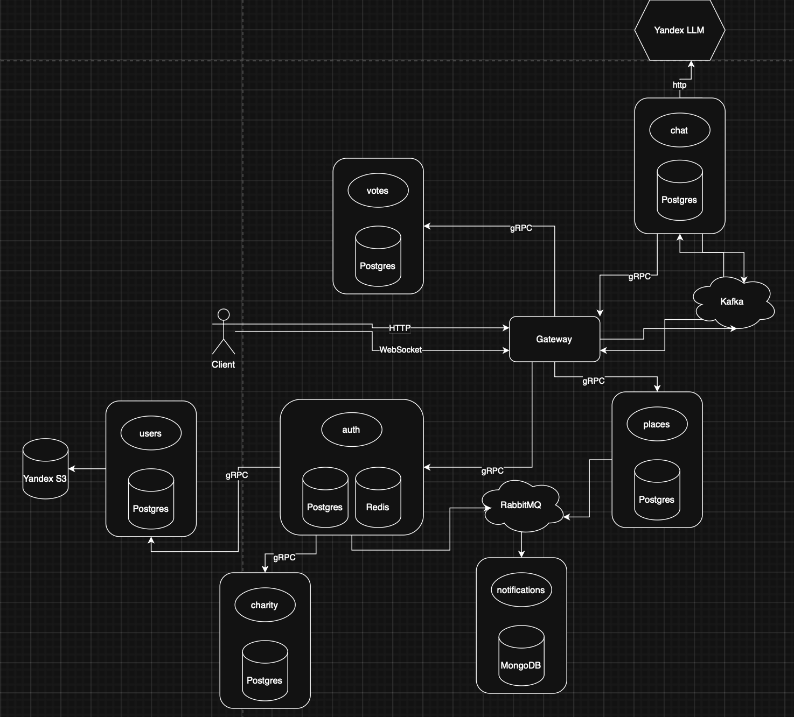
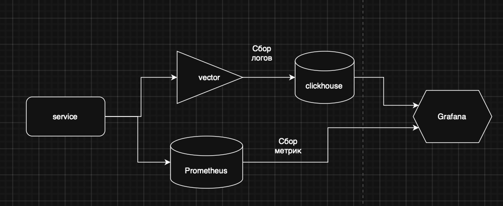

# 🏛️ Карта жителя Республики Татарстан API

> Платформа социальных сервисов для жителей Республики Татарстан с микросервисной архитектурой

[](https://golang.org/)  [](https://tatarstan-card.ru/api) [](https://tatarstan-card.ru/api/docs/swagger)

## 📋 Описание

Комплексная платформа социальных сервисов для жителей Республики Татарстан, включающая:

🤖 **Чат-бот помощник** - интеллектуальный помощник на базе Yandex LLM  
🗺️ **Поиск мест** - система поиска и рекомендации мест для посещения  
👤 **Авторизация** - безопасная регистрация и управление аккаунтами  
🗳️ **Голосования** - участие в голосованиях за республиканские проекты  
💝 **Благотворительность** - система благотворительных сборов и пожертвований

## 🚀 Технологии

### Архитектура

- **Микросервисная архитектура** с Clean Architecture принципами
- **API Gateway** на базе Chi Router
- **gRPC** для межсервисного взаимодействия
- **WebSocket** для real-time коммуникации

### Базы данных и хранилища

- **PostgreSQL** с pgxpool для реляционных данных
- **MongoDB** для документо-ориентированных данных
- **Redis** для кеширования и сессий
- **ClickHouse** для аналитики и логирования
- **S3** для файлового хранилища
- **Prometheus** для метрик

### Очереди и обмен сообщениями

- **Apache Kafka** для event streaming
- **RabbitMQ** для message queuing
- **Vector** для логирования и метрик
### Дополнительные сервисы

- **Yandex LLM** для AI-функций чат-бота
- **GoMail** для email уведомлений
- **Zerolog** для структурированного логирования
- **Viper** для управления конфигурацией

## 🏗️ Архитектура микросервисов



## 🏗️ Архитектура сбора метрик и логов



### Основные компоненты:

- **API Gateway** - единая точка входа, маршрутизация запросов
- **Auth Service** - регистрация, авторизация, управление пользователями
- **Places Service** - поиск и рекомендации мест для посещения
- **Chat Service** - AI чат-бот с интеграцией Yandex LLM
- **Voting Service** - система голосований за республиканские проекты
- **Charity Service** - управление благотворительными сборами
- **Notification Service** - отправка уведомлений и email

## 🌐 API Endpoints

**Backend URL:** `https://tatarstan-card.ru/api/...`

## 📚 Документация

|Тип|URL|Описание|
|---|---|---|
|**Stoplight**|[📖 Документация](https://kdt.stoplight.io/docs/kdt/vdycsik1ycmlf-karta-zhitelya-respubliki-tatarstan-api)|Интерактивная документация API|
|**Swagger**|[🔧 Swagger UI](https://tatarstan-card.ru/api/docs/swagger)|Тестирование API endpoints|
|**ReDoc**|[📑 ReDoc](https://tatarstan-card.ru/api/docs/redoc)|Альтернативное представление документации|

## ⚡ Быстрый старт

### Предварительные требования

- Go 1.21 или выше
- Docker и Docker Compose
- Доступ к Container Registry

### Установка
Перед этим уже должны быть запущены контейнеры с инфраструктурой.
Предварительно настроить config и добавить env.
```bash
# Клонирование нужного репозитория
git clone https://github.com/GP-Hacks/gateway-service
cd gateway-service

# Запуск deploy скрипта с параметрами
./scripts/deploy.sh "ENVIRONMENT" "YC_REGISTY/YC_REGISTRY_ID/IMAGE_NAME:IMAGE_TG" "CONTAINER_NAME" "PORT" "YC_OAUTH_TOKEN" 
```

### Конфигурация

Переменные окружения определены в файлах `config.go` каждого микросервиса.

## 🧪 Тестирование

```bash
# Запуск тестов для всех сервисов
go test ./...

# Запуск тестов с покрытием
go test -cover ./...

# Интеграционные тесты с Docker
docker-compose -f docker-compose.test.yml up --abort-on-container-exit
```

## 🚀 Развертывание

Проект использует автоматизированный процесс развертывания:

1. **Container Registry** - Docker образы хранятся в реестре контейнеров
2. **Lockbox** - безопасное управление секретами
3. **Docker Compose** - оркестрация инфраструктуры

## 📁 Структура проекта

```
GP-Hacks/
├── gateway-service/          # API Gateway
├── auth-service/            # Сервис авторизации
├── places-service/          # Сервис мест
├── chat-service/            # Чат-бот сервис
├── voting-service/          # Сервис голосований
├── charity-service/         # Благотворительный сервис
└── notification-service/    # Сервис уведомлений
```

## 🤝 Участие в разработке

1. Создайте fork нужного репозитория из [GP-Hacks](https://github.com/GP-Hacks)
2. Создайте ветку для новой функциональности (`git checkout -b feature/AmazingFeature`)
3. Зафиксируйте изменения (`git commit -m 'Add some AmazingFeature'`)
4. Отправьте изменения в ветку (`git push origin feature/AmazingFeature`)
5. Создайте Pull Request

## 📞 Контакты

- **GitHub:** [GP-Hacks](https://github.com/GP-Hacks)
- **Документация:** [Stoplight](https://kdt.stoplight.io/docs/kdt/vdycsik1ycmlf-karta-zhitelya-respubliki-tatarstan-api)
- **API:** [Swagger](https://tatarstan-card.ru/api/docs/swagger)

---

<div align="center">

**🏛️ Сделано для жителей Республики Татарстан**

_Объединяем технологии и социальные потребности_

</div>
